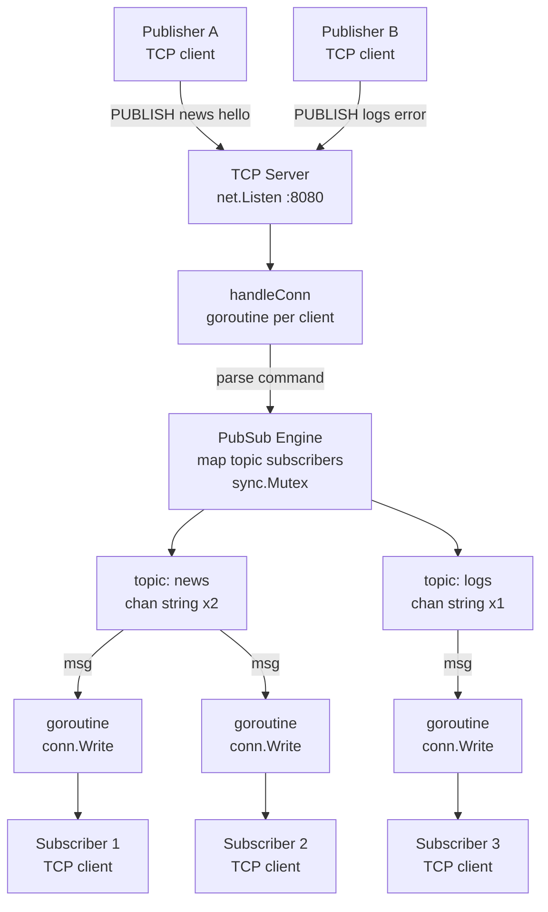

```mermaid
flowchart TD
    PA[Publisher A\nTCP client] -->|PUBLISH news hello| S
    PB[Publisher B\nTCP client] -->|PUBLISH logs error| S

    S[TCP Server\nnet.Listen :8080]
    S --> HC[handleConn\ngoroutine per client]
    HC -->|parse command| PS

    PS[PubSub Engine\nmap topic subscribers\nsync.Mutex]

    PS --> T1[topic: news\nchan string x2]
    PS --> T2[topic: logs\nchan string x1]

    T1 -->|msg| G1[goroutine\nconn.Write]
    T1 -->|msg| G2[goroutine\nconn.Write]
    T2 -->|msg| G3[goroutine\nconn.Write]

    G1 --> SUB1[Subscriber 1\nTCP client]
    G2 --> SUB2[Subscriber 2\nTCP client]
    G3 --> SUB3[Subscriber 3\nTCP client]
```
